  

  

  

---

# 🚀 Featured Projects

<table border="0">
  <tr>
    <td width="50%" valign="top">
      <h3>🩸 Blood Donor Connector</h3>
      
      
A full-stack platform connecting blood donors with patients and hospitals in real-time.

      <a href="https://github.com/sagorroy2003/Blood-Donor-Connector-Platform-University-Project"><b>View Repository →</b></a>
    </td>
    <td width="50%" valign="top">
      <h3>🛒 UniBazer - Student Marketplace</h3>
      
      
A multi-vendor marketplace tailored for university students to buy and sell safely.

      <a href="https://github.com/sagorroy2003/NSTU-MARKET-PLACE"><b>View Repository →</b></a>
    </td>
  </tr>
</table>

---

### 🛠️ Tech Stack & Skills

  
  
  
  
  
  

---

### 🏆 Problem Solving
*Consistency in problem-solving across multiple platforms.*

  

  
  
  
  
  

---

### 📊 GitHub Activity

  
  

  

---

### 🌱 Currently
- 📘 Strengthening **DSA & problem solving**
- 🌐 Learning **full-stack web development**
- 🎯 Preparing for **software engineering roles**

🏆 Runner-up — ♟️ Chess Competition, **NSTU National Science Fest**
